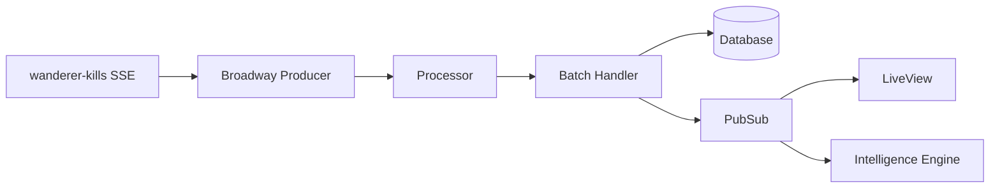

# EVE DMV Architecture

This document provides a comprehensive overview of the EVE DMV (EVE Online PvP Tracker) system architecture, design patterns, and implementation details.

## Table of Contents

1. [System Overview](#system-overview)
2. [Technology Stack](#technology-stack)
3. [Architecture Patterns](#architecture-patterns)
4. [Core Components](#core-components)
5. [Data Flow](#data-flow)
6. [Database Design](#database-design)
7. [API Design](#api-design)
8. [Security Architecture](#security-architecture)
9. [Performance Considerations](#performance-considerations)
10. [Deployment Architecture](#deployment-architecture)

## System Overview

EVE DMV is a real-time PvP intelligence platform for EVE Online players that:

- Ingests killmail data from multiple sources in real-time
- Provides advanced analytics on PvP performance and patterns
- Offers surveillance capabilities for tracking specific entities
- Analyzes fleet compositions and battle dynamics
- Delivers character and corporation intelligence

### Key Design Principles

1. **Real-time Processing**: Broadway pipelines for streaming data
2. **Declarative Resources**: Ash Framework for domain modeling
3. **Live Updates**: Phoenix LiveView for real-time UI
4. **Scalable Storage**: PostgreSQL with partitioning and materialized views
5. **Clean Architecture**: Bounded contexts with clear separation

## Technology Stack

### Core Technologies

- **Language**: Elixir 1.17.3
- **Framework**: Phoenix 1.7.21 with LiveView
- **Resource Layer**: Ash Framework 3.4 (replaces traditional Ecto schemas)
- **Database**: PostgreSQL 16 with partitioning
- **Streaming**: Broadway for data pipelines
- **Authentication**: EVE SSO OAuth2
- **Caching**: ETS and Redis
- **Monitoring**: OpenTelemetry

### Key Dependencies

```elixir
# Core
phoenix: "~> 1.7.21"
ash: "~> 3.4"
ash_postgres: "~> 2.0"
broadway: "~> 1.0"

# Authentication
ash_authentication: "~> 4.0"
ash_authentication_phoenix: "~> 2.0"

# Real-time
phoenix_live_view: "~> 1.0"
phoenix_pubsub: "~> 2.1"

# Performance
telemetry: "~> 1.2"
opentelemetry: "~> 1.3"
```

## Architecture Patterns

### 1. Hexagonal Architecture

The application follows hexagonal architecture principles with clear boundaries:

```
lib/eve_dmv/
├── contexts/           # Bounded contexts (domain logic)
│   ├── battle_analysis/
│   ├── character_intelligence/
│   ├── surveillance/
│   └── ...
├── infrastructure/     # External adapters
├── eve/               # EVE API integrations
├── database/          # Data access layer
└── workers/           # Background processing
```

### 2. Domain-Driven Design

Each bounded context contains:

- **Domain**: Business logic and services
- **Resources**: Ash resource definitions
- **API**: Public interface for the context
- **Infrastructure**: External integrations

### 3. Event-Driven Architecture

```elixir
# Domain events flow through the system
EveDmv.DomainEvents
├── KillmailIngested
├── BattleDetected
├── ThreatScoreUpdated
└── SurveillanceMatchFound
```

### 4. CQRS Pattern

- **Commands**: Handled through Ash actions
- **Queries**: Optimized with materialized views
- **Read Models**: Separate projections for UI

## Core Components

### 1. Data Ingestion Pipeline

```elixir
# Broadway pipeline architecture
KillmailPipeline
├── SSEProducer         # Connects to wanderer-kills SSE
├── Processor           # Validates and transforms
├── BatchHandler        # Bulk database inserts
└── Broadcaster         # PubSub notifications
```

### 2. Ash Framework Integration

Resources replace traditional Ecto schemas:

```elixir
defmodule EveDmv.Killmails.KillmailRaw do
  use Ash.Resource,
    domain: EveDmv.Api,
    data_layer: AshPostgres.DataLayer

  postgres do
    table "killmails_raw"
    partition_by :month, field: :killmail_time
  end

  actions do
    defaults [:read, :destroy]
    
    create :create do
      primary? true
      accept [:killmail_id, :killmail_hash, ...]
    end
  end
end
```

### 3. LiveView Architecture

```elixir
# LiveView components structure
EveDmvWeb.Live/
├── kill_feed_live.ex        # Real-time kill feed
├── character_intelligence_live.ex
├── surveillance_live/
│   ├── profile_service.ex
│   └── components.ex
└── battle_analysis_live.ex
```

### 4. Intelligence Engine

```elixir
# Multi-dimensional analysis system
IntelligenceEngine
├── ThreatScoringEngine     # Character threat assessment
├── BattleDetector          # Clustering algorithm
├── FleetAnalyzer           # Composition analysis
└── PatternDetector         # Behavioral patterns
```

## Data Flow

### 1. Killmail Processing Flow



### 2. Authentication Flow


### 3. Real-time Updates

```elixir
# PubSub topics
"killmail:new"           # New killmail received
"battle:detected"        # Battle identified
"surveillance:match"     # Profile match found
"character:#{id}"        # Character-specific updates
```

## Database Design

### 1. Partitioning Strategy

```sql
-- Monthly partitioned tables for scalability
CREATE TABLE killmails_raw (
    killmail_id BIGINT PRIMARY KEY,
    killmail_time TIMESTAMPTZ NOT NULL,
    ...
) PARTITION BY RANGE (killmail_time);

-- Automatic partition creation
CREATE TABLE killmails_raw_2025_01 
PARTITION OF killmails_raw 
FOR VALUES FROM ('2025-01-01') TO ('2025-02-01');
```

### 2. Materialized Views

```sql
-- Pre-computed aggregations for performance
CREATE MATERIALIZED VIEW character_combat_stats AS
SELECT 
    character_id,
    COUNT(*) FILTER (WHERE is_victim = false) as kills,
    COUNT(*) FILTER (WHERE is_victim = true) as deaths,
    SUM(total_value) FILTER (WHERE is_victim = false) as isk_destroyed
FROM participants
GROUP BY character_id;

-- Incremental refresh strategy
REFRESH MATERIALIZED VIEW CONCURRENTLY character_combat_stats;
```

### 3. Index Strategy

```sql
-- Covering indexes for common queries
CREATE INDEX idx_participants_character_lookup 
ON participants(character_id, killmail_time DESC) 
INCLUDE (is_victim, ship_type_id, total_value);

-- Partial indexes for specific queries
CREATE INDEX idx_killmails_recent_high_value 
ON killmails_raw(killmail_time DESC, total_value) 
WHERE killmail_time > NOW() - INTERVAL '7 days' 
  AND total_value > 1000000000;
```

## API Design

### 1. Ash Domain Structure

```elixir
# Main API domains
EveDmv.Api                    # Core resources
EveDmv.Api.SurveillanceApi    # Surveillance features
EveDmv.Api.AnalyticsApi       # Analytics resources
EveDmv.Api.BattleAnalysisApi  # Battle analysis

# Query safety built-in
use Ash.Domain,
  default_read_preparations: [{QuerySafety, [limit: 1000]}]
```

### 2. REST API Endpoints

```elixir
# API routes with authentication
scope "/api/v1", EveDmvWeb.Api do
  pipe_through [:api, :api_auth]
  
  resources "/battles", BattleIntelligenceController
  resources "/characters/:id/threat", CharacterThreatController
  post "/battles/:id/share", BattleShareController, :create
end
```

### 3. GraphQL Potential

The Ash framework supports GraphQL out of the box, enabling future GraphQL API if needed.

## Security Architecture

### 1. Authentication Layers

```elixir
# Multiple authentication methods
1. EVE SSO OAuth2        # Primary user authentication
2. API Keys              # Programmatic access
3. Session Management    # 24-hour configurable timeout
4. Token Refresh         # Automatic token renewal
```

### 2. Authorization

```elixir
# Role-based access control
defmodule EveDmv.Users.User do
  policies do
    policy :user_can_see_own_data do
      authorize_if expr(id == ^actor(:id))
    end
    
    policy :admin_can_see_all do
      authorize_if expr(^actor(:is_admin) == true)
    end
  end
end
```

### 3. Security Headers

```elixir
# Comprehensive security headers
plug EveDmvWeb.Plugs.SecurityHeaders
- Content-Security-Policy
- X-Frame-Options
- X-Content-Type-Options
- Referrer-Policy
```

## Performance Considerations

### 1. Caching Strategy

```elixir
# Multi-layer caching
1. ETS            # In-memory for hot data
2. Query Cache    # Database query results
3. Static Cache   # Ship/system names
4. Analysis Cache # Expensive calculations
```

### 2. Database Optimizations

```elixir
# Performance features
- Partitioned tables for time-series data
- Materialized views for aggregations
- Covering indexes for common queries
- Connection pooling with overflow
- Query plan analysis and monitoring
```

### 3. Real-time Processing

```elixir
# Broadway configuration
@impl Broadway
def handle_batch(:default, messages, _batch_info, _context) do
  # Bulk insert for efficiency
  Ash.bulk_create(KillmailRaw, killmails, 
    batch_size: 1000,
    return_errors?: false
  )
end
```

### 4. Monitoring & Telemetry

```elixir
# Comprehensive monitoring
:telemetry.attach_many("eve-dmv-repo",
  [
    [:eve_dmv, :repo, :query],
    [:broadway, :processor, :stop],
    [:phoenix, :live_view, :mount]
  ],
  &handle_event/4
)
```

## Deployment Architecture

### 1. Container Strategy

```dockerfile
# Multi-stage build for optimization
FROM elixir:1.17.3-alpine AS build
# Build stage with dependencies

FROM alpine:3.20 AS app
# Minimal runtime with only essentials
```

### 2. Environment Configuration

```bash
# Key environment variables
DATABASE_URL              # PostgreSQL connection
EVE_SSO_CLIENT_ID        # OAuth credentials
SECRET_KEY_BASE          # Phoenix encryption
WANDERER_KILLS_SSE_URL   # Data source
PIPELINE_ENABLED         # Feature flags
```

### 3. Production Considerations

```elixir
# Production optimizations
- Database connection pooling
- Redis for distributed caching
- Horizontal scaling with libcluster
- Health check endpoints
- Graceful shutdown handling
- Automatic static data loading
```

### 4. Monitoring Stack

```yaml
# Observability tools
- OpenTelemetry for tracing
- Prometheus metrics export
- Custom performance dashboards
- Error tracking with Sentry potential
- Database query analysis
```

## Development Workflow

### 1. Quality Gates

```bash
# Automated quality checks
mix compile --warnings-as-errors
mix format --check-formatted
mix credo --strict
mix dialyzer
mix test --cover
```

### 2. Database Migrations

```bash
# Ash-specific migration workflow
mix ash_postgres.create      # Generate from resources
mix ash_postgres.migrate     # Apply migrations
```

### 3. Static Data Management

```elixir
# Automatic SDE updates
EveDmv.Eve.StaticDataLoader.SdeStartupService
- Checks for updates on startup
- Downloads latest SDE data
- Loads into database tables
- Warms caches
```

## Future Considerations

### 1. Scalability Path

- Implement read replicas for analytics queries
- Consider TimescaleDB for time-series optimization
- Add GraphQL API for flexible queries
- Implement event sourcing for audit trail

### 2. Feature Expansion

- WebSocket connections for lower latency
- Machine learning for pattern detection
- Mobile application with React Native
- Corporation management tools

### 3. Technical Debt

- Complete removal of placeholder implementations
- Improve test coverage to 80%+
- Implement comprehensive API documentation
- Add performance regression testing

## Conclusion

EVE DMV's architecture prioritizes real-time performance, clean domain boundaries, and maintainability. The use of Ash Framework provides a declarative approach to resource management, while Broadway enables efficient stream processing. The system is designed to scale horizontally and handle the high-volume, real-time nature of EVE Online PvP data.