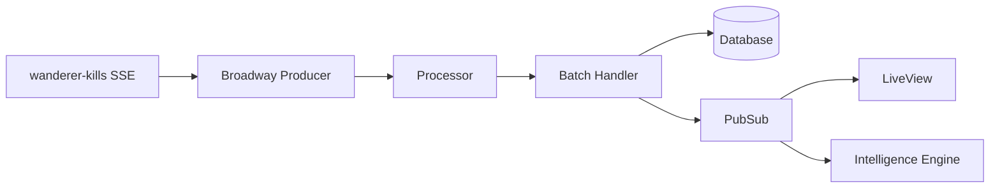
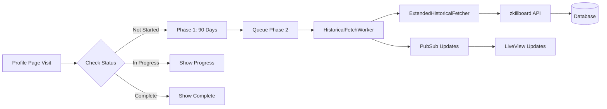

# EVE DMV Architecture

This document provides a comprehensive overview of the EVE DMV (EVE Online PvP Tracker) system architecture, design patterns, and implementation details.

## Table of Contents

1. [System Overview](#system-overview)
2. [Technology Stack](#technology-stack)
3. [Architecture Patterns](#architecture-patterns)
4. [Core Components](#core-components)
5. [Data Flow](#data-flow)
6. [Database Design](#database-design)
7. [API Design](#api-design)
8. [Security Architecture](#security-architecture)
9. [Performance Considerations](#performance-considerations)
10. [Deployment Architecture](#deployment-architecture)

## System Overview

EVE DMV is a real-time PvP intelligence platform for EVE Online players that:

- Ingests killmail data from multiple sources in real-time
- Provides advanced analytics on PvP performance and patterns
- Offers surveillance capabilities for tracking specific entities
- Analyzes fleet compositions and battle dynamics
- Delivers character and corporation intelligence

### Key Design Principles

1. **Real-time Processing**: Broadway pipelines for streaming data
2. **Declarative Resources**: Ash Framework for domain modeling
3. **Live Updates**: Phoenix LiveView for real-time UI
4. **Scalable Storage**: PostgreSQL with partitioning and materialized views
5. **Clean Architecture**: Bounded contexts with clear separation

## Technology Stack

### Core Technologies

- **Language**: Elixir 1.19+
- **Framework**: Phoenix 1.8 with LiveView
- **Resource Layer**: Ash Framework 3.7 (replaces traditional Ecto schemas)
- **Database**: PostgreSQL 18 with partitioning
- **Streaming**: Broadway for data pipelines
- **Authentication**: EVE SSO OAuth2
- **Caching**: ETS and Cachex
- **Monitoring**: OpenTelemetry

### Key Dependencies

```elixir
# Core
phoenix: "~> 1.8"
ash: "~> 3.7"
ash_postgres: "~> 2.4"
broadway: "~> 1.1"

# Authentication
ash_authentication: "~> 4.0"
ash_authentication_phoenix: "~> 2.1"

# Real-time
phoenix_live_view: "~> 1.0"
phoenix_pubsub: "~> 2.1"

# Caching
cachex: "~> 4.1"

# HTTP Clients
finch: "~> 0.13"
tesla: "~> 1.8"
gun: "~> 2.0"
```

## Architecture Patterns

### 1. Hexagonal Architecture

The application follows hexagonal architecture principles with clear boundaries:

```
lib/eve_dmv/
├── contexts/                    # Bounded contexts (domain logic)
│   ├── battle_analysis/         # Battle detection and analysis
│   ├── battle_sharing/          # Battle report sharing
│   ├── character_intelligence/  # Character threat scoring
│   ├── combat/                  # Combat analysis and metrics
│   ├── combat_intelligence/     # Combat intelligence gathering
│   ├── corporation/             # Corporation analysis
│   ├── corporation_intelligence/# Corp intelligence
│   ├── fleet_operations/        # Fleet composition analysis
│   ├── intelligence/            # Intelligence engine
│   ├── intelligence_infrastructure/ # Regional/constellation analysis
│   ├── killmail_processing/     # Killmail pipeline handling
│   ├── market_intelligence/     # Market data and pricing
│   ├── player_profile/          # Player profile analysis
│   ├── surveillance/            # Real-time entity monitoring
│   ├── system_analysis/         # System/region analysis
│   ├── threat_assessment/       # Threat scoring
│   └── threat_surveillance/     # Threat monitoring
│
├── core/                  # Shared kernel (cross-cutting domain)
│   ├── config/            # Configuration management
│   ├── errors/            # Error types and handling
│   ├── events/            # Domain event infrastructure
│   ├── shared_kernel/     # Shared domain primitives
│   └── utils/             # Utility functions (DateTimeUtils, etc.)
│
├── external/              # External service adapters
│   ├── eve/               # EVE ESI API client and static data
│   ├── killmails/         # Killmail processing & broadcasting
│   ├── market/            # Market data (Janice, MutaMarket)
│   └── wanderer/          # Wanderer-kills integration
│
├── platform/              # Platform services (infrastructure)
│   ├── auth/              # Authentication services
│   ├── cache/             # Multi-layer caching (ETS, Cachex)
│   ├── database/          # Repositories and query utilities
│   ├── monitoring/        # Telemetry and metrics
│   ├── pubsub/            # Event broadcasting
│   └── workers/           # Background job processing
│
├── api/                   # Ash API domain definitions
├── static_data/           # EVE static data (ships, systems)
├── users/                 # User and authentication resources
└── intelligence_engine/   # Plugin-based intelligence system
```

### Key Directory Conventions

- **contexts/**: Each context follows a consistent structure:
  - `api.ex` - **Required**: Public API interface, the only entry point for other contexts
  - `core/` or `domain/` - Business logic and services
  - `analyzers/` - Analysis algorithms (if applicable)
  - `resources/` - Ash resource definitions (if applicable)
  - `infrastructure/` - External integrations for this context (if applicable)

  Example context structure:
  ```
  character_intelligence/
  ├── api.ex                    # Public API
  ├── threat_config.ex          # Configuration constants
  ├── analyzers/                # Analysis algorithms
  ├── domain/                   # Business logic
  │   ├── threat_scoring_engine.ex
  │   └── threat_scoring/       # Sub-modules
  └── resources/                # Ash resources
  ```

- **core/**: Domain primitives shared across contexts (avoid cross-context dependencies)

- **external/**: All external API integrations. Uses PubSub for broadcasting
  (never imports web layer directly)

- **platform/**: Infrastructure that supports the application but isn't domain-specific

### 2. Domain-Driven Design

Each bounded context contains:

- **Domain**: Business logic and services
- **Resources**: Ash resource definitions
- **API**: Public interface for the context
- **Infrastructure**: External integrations

### 3. Event-Driven Architecture

```elixir
# Domain events flow through the system
EveDmv.DomainEvents
├── KillmailIngested
├── BattleDetected
├── ThreatScoreUpdated
└── SurveillanceMatchFound
```

### 4. CQRS Pattern

- **Commands**: Handled through Ash actions
- **Queries**: Optimized with materialized views
- **Read Models**: Separate projections for UI

## Core Components

### 1. Data Ingestion Pipeline

```elixir
# Broadway pipeline architecture
KillmailPipeline
├── SSEProducer         # Connects to wanderer-kills SSE
├── Processor           # Validates and transforms
├── BatchHandler        # Bulk database inserts
└── Broadcaster         # PubSub notifications
```

### 2. Ash Framework Integration

Resources replace traditional Ecto schemas:

```elixir
defmodule EveDmv.Killmails.KillmailRaw do
  use Ash.Resource,
    domain: EveDmv.Api,
    data_layer: AshPostgres.DataLayer

  postgres do
    table "killmails_raw"
    partition_by :month, field: :killmail_time
  end

  actions do
    defaults [:read, :destroy]
    
    create :create do
      primary? true
      accept [:killmail_id, :killmail_hash, ...]
    end
  end
end
```

### 3. LiveView Architecture

```elixir
# LiveView components structure
EveDmvWeb.Live/
├── kill_feed_live.ex        # Real-time kill feed
├── character_intelligence_live.ex
├── surveillance_live/
│   ├── profile_service.ex
│   └── components.ex
└── battle_analysis_live.ex
```

### 4. Historical Fetch System

Two-phase killmail retrieval extending data from 90 days to 2 years:

```
Phase 1 (Synchronous): 90 days via wanderer-kills SSE
Phase 2 (Background):  91 days to 2 years via zkillboard API
```

**Architecture:**

```elixir
# Key components
HistoricalFetchStatus     # Ash resource tracking fetch state
├── entity_type           # :character, :corporation, :system, :alliance
├── entity_id             # EVE entity ID
├── status                # :pending, :phase1_complete, :in_progress, :completed, :failed
├── killmails_fetched     # Count of kills retrieved
└── progress_percentage   # Calculated progress (0-100)

HistoricalFetchWorker     # GenServer managing background queue
├── queue_fetch/2         # Add entity to queue
├── get_status/2          # Check current status
├── subscribe/2           # PubSub subscription for updates
└── unsubscribe/2         # Remove subscription

ExtendedHistoricalFetcher # zkillboard API integration
├── fetch_extended_history/3  # Main entry point
├── Rate limiting             # 1 second between requests
├── Pagination                # Up to 100 pages (20,000 kills)
└── Error handling            # Automatic retry with backoff
```

**PubSub Integration:**

```elixir
# Topic format
"historical_fetch_updates:#{entity_type}:#{entity_id}"

# Message format
{:historical_fetch_update, entity_type, entity_id, update}
# where update is:
#   :started
#   {:progress, %{killmails_fetched: n, oldest_date: date}}
#   {:completed, %{killmails_fetched: n}}
#   {:failed, reason}
```

### 5. Intelligence Engine

```elixir
# Multi-dimensional analysis system
IntelligenceEngine
├── ThreatScoringEngine     # Character threat assessment
├── ThreatConfig            # Documented configuration constants
├── BattleDetector          # Clustering algorithm
├── FleetAnalyzer           # Composition analysis
└── PatternDetector         # Behavioral patterns
```

### 6. Configuration Patterns

The codebase uses dedicated configuration modules with documented rationale for algorithm parameters:

```elixir
# lib/eve_dmv/contexts/character_intelligence/threat_config.ex
defmodule EveDmv.Contexts.CharacterIntelligence.ThreatConfig do
  @moduledoc """
  Configuration constants for threat scoring calculations.
  All values are documented with rationale based on EVE Online combat statistics.
  """

  # Ship classification using EVE SDE group IDs
  @frigate_group_ids [25]
  @capital_group_ids [485, 547, 659, 30, 1538, 883]

  # Normalization thresholds with documented rationale
  @ship_usage_normalization 10  # Top 10% PvPers use 10+ ship types

  def classify_by_group_id(group_id), do: ...
end
```

Key principles:
- **Document rationale**: Every threshold includes a comment explaining why
- **Use SDE data**: Ship classifications use EVE group IDs, not hardcoded type ranges
- **Centralize constants**: Related thresholds live in one configuration module
- **Public API**: Expose values via documented functions with `@spec`

### 7. Ash Migration Patterns

The codebase is undergoing a gradual migration from raw SQL queries to Ash-native approaches. This section documents the patterns and infrastructure supporting this migration.

#### Calculation Helpers

Shared calculation utilities are centralized in `lib/eve_dmv/calculations/`:

```elixir
# lib/eve_dmv/calculations/helpers.ex
defmodule EveDmv.Calculations.Helpers do
  @moduledoc "Pure functions for common mathematical operations."

  # Safe division with zero handling
  def safe_divide(10, 2)  # => 5.0
  def safe_divide(10, 0)  # => 0.0 (default)

  # K/D ratio with infinite handling
  def kd_ratio(10, 5)     # => 2.0
  def kd_ratio(10, 0)     # => 10.0 (no deaths)

  # ISK efficiency percentage
  def isk_efficiency(100_000_000, 50_000_000)  # => 66.67

  # Normalization to 0.0-1.0 scale
  def normalize(5, 10)    # => 0.5
end
```

Use `EveDmv.Calculations.Base` as a base module for Ash calculations:

```elixir
defmodule MyCalculation do
  use EveDmv.Calculations.Base
  # Automatically imports Helpers functions
end
```

#### Query Migration Feature Flags

The `EveDmv.Config.QueryMigration` module provides feature flags for gradual rollout:

```elixir
# Check if Ash-based queries should be used
if QueryMigration.use_ash_character_stats?() do
  CharacterStats.calculate_for_character(character_id, since_date)
else
  CharacterQueries.get_character_stats(character_id, since_date)
end

# Available flags
QueryMigration.use_ash_character_stats?()
QueryMigration.use_ash_corporation_stats?()
QueryMigration.use_ash_killmail_queries?()
QueryMigration.log_comparison_mismatches?()  # For validation
QueryMigration.shadow_mode?()                 # Test without affecting users
```

#### Virtual Resources for Statistics

Statistics are computed via virtual Ash resources (`:embedded` data layer):

```elixir
defmodule EveDmv.Contexts.CharacterIntelligence.Resources.CharacterStats do
  use Ash.Resource,
    domain: EveDmv.Api,
    data_layer: :embedded

  attributes do
    attribute :character_id, :integer, primary_key?: true
    attribute :kills, :integer, default: 0
    attribute :deaths, :integer, default: 0
  end

  calculations do
    calculate :kd_ratio, :float, expr(
      if deaths > 0, do: kills / deaths, else: kills * 1.0
    )
  end

  actions do
    action :calculate, :struct do
      argument :character_id, :integer, allow_nil?: false
      run fn input, _context ->
        # Compute from Participant records
      end
    end
  end
end
```

#### Migration Strategy

1. **Create Ash implementation** alongside existing SQL
2. **Enable comparison logging** to validate correctness
3. **Use shadow mode** to test without affecting users
4. **Gradually enable** via feature flags
5. **Add deprecation warnings** to old functions
6. **Remove old implementation** once validated

### 8. Canonical Analyzers

The following are the authoritative implementations for each analysis type.
Other implementations with similar names are deprecated and delegate to these:

| Analysis Type | Canonical Module | Notes |
|--------------|-----------------|-------|
| **Battle Analysis** | `BattleAnalysis.Core.OptimizedBattleAnalyzer` | N+1 query optimized |
| **Cached Battle Analysis** | `BattleAnalysis.Core.CachedBattleAnalyzer` | Wraps OptimizedBattleAnalyzer |
| **Corporation Analysis** | `Corporation.Core.CorporationAnalyzer` | GenServer-based |
| **Character Analysis** | `Intelligence.Core.CharacterAnalyzer` | GenServer-based |
| **Character Intelligence** | `CharacterIntelligence.Analyzers.CharacterIntelligenceAnalyzer` | Detailed query-based |

**Deprecated modules** (use canonical instead):
- `Combat.Core.BattleAnalyzer` → Use `BattleAnalysis.Core.OptimizedBattleAnalyzer`
- `CombatIntelligence.Domain.CorporationAnalyzer` → Use `Corporation.Core.CorporationAnalyzer`
- `CombatIntelligence.Domain.CharacterAnalyzer` → Use `Intelligence.Core.CharacterAnalyzer`

## Data Flow

### 1. Killmail Processing Flow



### 2. Authentication Flow


### 3. Real-time Updates

```elixir
# PubSub topics
"killmail:new"                              # New killmail received
"battle:detected"                           # Battle identified
"surveillance:match"                        # Profile match found
"character:#{id}"                           # Character-specific updates
"historical_fetch_updates:#{type}:#{id}"    # Historical fetch progress
```

### 4. Historical Fetch Flow



## Database Design

### 1. Partitioning Strategy

```sql
-- Monthly partitioned tables for scalability
CREATE TABLE killmails_raw (
    killmail_id BIGINT PRIMARY KEY,
    killmail_time TIMESTAMPTZ NOT NULL,
    ...
) PARTITION BY RANGE (killmail_time);

-- Automatic partition creation
CREATE TABLE killmails_raw_2025_01 
PARTITION OF killmails_raw 
FOR VALUES FROM ('2025-01-01') TO ('2025-02-01');
```

### 2. Materialized Views

```sql
-- Pre-computed aggregations for performance
CREATE MATERIALIZED VIEW character_combat_stats AS
SELECT 
    character_id,
    COUNT(*) FILTER (WHERE is_victim = false) as kills,
    COUNT(*) FILTER (WHERE is_victim = true) as deaths,
    SUM(total_value) FILTER (WHERE is_victim = false) as isk_destroyed
FROM participants
GROUP BY character_id;

-- Incremental refresh strategy
REFRESH MATERIALIZED VIEW CONCURRENTLY character_combat_stats;
```

### 3. Index Strategy

```sql
-- Covering indexes for common queries
CREATE INDEX idx_participants_character_lookup 
ON participants(character_id, killmail_time DESC) 
INCLUDE (is_victim, ship_type_id, total_value);

-- Partial indexes for specific queries
CREATE INDEX idx_killmails_recent_high_value 
ON killmails_raw(killmail_time DESC, total_value) 
WHERE killmail_time > NOW() - INTERVAL '7 days' 
  AND total_value > 1000000000;
```

## API Design

### 1. Ash Domain Structure

```elixir
# Main API domains
EveDmv.Api                    # Core resources
EveDmv.Api.SurveillanceApi    # Surveillance features
EveDmv.Api.AnalyticsApi       # Analytics resources
EveDmv.Api.BattleAnalysisApi  # Battle analysis

# Query safety built-in
use Ash.Domain,
  default_read_preparations: [{QuerySafety, [limit: 1000]}]
```

### 2. REST API Endpoints

```elixir
# API routes with authentication
scope "/api/v1", EveDmvWeb.Api do
  pipe_through [:api, :api_auth]
  
  resources "/battles", BattleIntelligenceController
  resources "/characters/:id/threat", CharacterThreatController
  post "/battles/:id/share", BattleShareController, :create
end
```

### 3. GraphQL Potential

The Ash framework supports GraphQL out of the box, enabling future GraphQL API if needed.

## Security Architecture

### 1. Authentication Layers

```elixir
# Multiple authentication methods
1. EVE SSO OAuth2        # Primary user authentication
2. API Keys              # Programmatic access
3. Session Management    # 24-hour configurable timeout
4. Token Refresh         # Automatic token renewal
```

### 2. Authorization

```elixir
# Role-based access control
defmodule EveDmv.Users.User do
  policies do
    policy :user_can_see_own_data do
      authorize_if expr(id == ^actor(:id))
    end
    
    policy :admin_can_see_all do
      authorize_if expr(^actor(:is_admin) == true)
    end
  end
end
```

### 3. Security Headers

```elixir
# Comprehensive security headers
plug EveDmvWeb.Plugs.SecurityHeaders
- Content-Security-Policy
- X-Frame-Options
- X-Content-Type-Options
- Referrer-Policy
```

## Performance Considerations

### 1. Caching Strategy

```elixir
# Multi-layer caching
1. ETS            # In-memory for hot data
2. Query Cache    # Database query results
3. Static Cache   # Ship/system names
4. Analysis Cache # Expensive calculations
```

### 2. Database Optimizations

```elixir
# Performance features
- Partitioned tables for time-series data
- Materialized views for aggregations
- Covering indexes for common queries
- Connection pooling with overflow
- Query plan analysis and monitoring
```

### 3. Real-time Processing

```elixir
# Broadway configuration
@impl Broadway
def handle_batch(:default, messages, _batch_info, _context) do
  # Bulk insert for efficiency
  Ash.bulk_create(KillmailRaw, killmails, 
    batch_size: 1000,
    return_errors?: false
  )
end
```

### 4. Monitoring & Telemetry

```elixir
# Comprehensive monitoring
:telemetry.attach_many("eve-dmv-repo",
  [
    [:eve_dmv, :repo, :query],
    [:broadway, :processor, :stop],
    [:phoenix, :live_view, :mount]
  ],
  &handle_event/4
)
```

## Deployment Architecture

### 1. Container Strategy

```dockerfile
# Multi-stage build for optimization
FROM elixir:1.19-alpine AS build
# Build stage with dependencies

FROM alpine:3.20 AS app
# Minimal runtime with only essentials
```

### 2. Environment Configuration

```bash
# Key environment variables
DATABASE_URL              # PostgreSQL connection
EVE_SSO_CLIENT_ID        # OAuth credentials
SECRET_KEY_BASE          # Phoenix encryption
WANDERER_KILLS_SSE_URL   # Data source
PIPELINE_ENABLED         # Feature flags
```

### 3. Production Considerations

```elixir
# Production optimizations
- Database connection pooling
- Redis for distributed caching
- Horizontal scaling with libcluster
- Health check endpoints
- Graceful shutdown handling
- Automatic static data loading
```

### 4. Monitoring Stack

```yaml
# Observability tools
- OpenTelemetry for tracing
- Prometheus metrics export
- Custom performance dashboards
- Error tracking with Sentry potential
- Database query analysis
```

## Development Workflow

### 1. Quality Gates

```bash
# Automated quality checks
mix compile --warnings-as-errors
mix format --check-formatted
mix credo --strict
mix dialyzer
mix test --cover
```

### 2. Database Migrations

```bash
# Ash-specific migration workflow
mix ash_postgres.create      # Generate from resources
mix ash_postgres.migrate     # Apply migrations
```

### 3. Static Data Management

```elixir
# Automatic SDE updates
EveDmv.Eve.StaticDataLoader.SdeStartupService
- Checks for updates on startup
- Downloads latest SDE data
- Loads into database tables
- Warms caches
```

## Future Considerations

### 1. Scalability Path

- Implement read replicas for analytics queries
- Consider TimescaleDB for time-series optimization
- Add GraphQL API for flexible queries
- Implement event sourcing for audit trail

### 2. Feature Expansion

- WebSocket connections for lower latency
- Machine learning for pattern detection
- Mobile application with React Native
- Corporation management tools

### 3. Technical Debt

- Improve test coverage (currently 40% minimum)
- Implement comprehensive API documentation
- Add performance regression testing
- Consolidate duplicate analyzer implementations

## Conclusion

EVE DMV's architecture prioritizes real-time performance, clean domain boundaries, and maintainability. The use of Ash Framework provides a declarative approach to resource management, while Broadway enables efficient stream processing. The system is designed to scale horizontally and handle the high-volume, real-time nature of EVE Online PvP data.