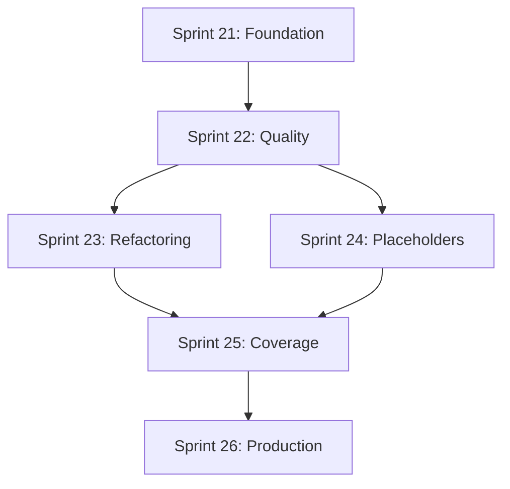

# EVE DMV Comprehensive Sprint Series Plan

*Created: 2025-07-20*

This document combines the Quality Issues Resolution Plan, Implementation Strategy, and Sprint Template to create a comprehensive 6-sprint series (12 weeks) that will transform EVE DMV from its current state (35/100 quality score) to production-ready (80+/100).

## Strategic Overview

**Duration**: 6 sprints × 2 weeks = 12 weeks total  
**Approach**: Systematic cleanup combining quality improvements with feature completion  
**Current State**: 1,762 Credo issues, 134 TODOs, 22 large modules, 9 test failures  
**Target State**: Production-ready codebase with 70%+ coverage, <50 issues, 0 failures

## Sprint Series Architecture

### Sprint 21: Foundation Stabilization (Weeks 1-2) 
**Theme**: Critical Infrastructure & Test Stability  
**Goal**: Fix broken foundation and establish quality gates  
**Effort**: 8-10 developer days

### Sprint 22: Quality Standards Implementation (Weeks 3-4)
**Theme**: Code Quality & Style Standardization  
**Goal**: Reduce Credo issues by 70% and implement bulk fixes  
**Effort**: 10-12 developer days

### Sprint 23: Large Module Refactoring (Weeks 5-6)
**Theme**: Architecture & Module Size Optimization  
**Goal**: Eliminate critical-sized modules and improve maintainability  
**Effort**: 12-15 developer days

### Sprint 24: Placeholder Elimination (Weeks 7-8)
**Theme**: Real Implementation & Feature Completion  
**Goal**: Remove all placeholder code and implement missing features  
**Effort**: 10-14 developer days

### Sprint 25: Coverage & Testing Enhancement (Weeks 9-10)
**Theme**: Test Coverage & Quality Assurance  
**Goal**: Achieve 70% coverage and comprehensive testing  
**Effort**: 8-12 developer days

### Sprint 26: Production Readiness (Weeks 11-12)
**Theme**: Final Polish & Deployment Preparation  
**Goal**: Final optimizations and production deployment readiness  
**Effort**: 6-10 developer days

---

## Sprint Sequence Integration

### Dependencies & Flow

### Quality Progression Target
- **Start**: 35/100 quality score
- **Sprint 21**: 45/100 (foundation stable)
- **Sprint 22**: 55/100 (style standardized)
- **Sprint 23**: 65/100 (architecture improved)
- **Sprint 24**: 75/100 (real implementations)
- **Sprint 25**: 85/100 (testing complete)
- **Sprint 26**: 90+/100 (production ready)

---

## Resource Requirements & Team Structure

### Team Composition
- **1 Senior Elixir Developer** (Architecture, complex refactoring)
- **1-2 Mid-level Developers** (Implementation, testing)
- **1 DevOps Engineer** (CI/CD, tooling - part-time)

### Skill Distribution by Sprint
- **Sprints 21-22**: Focus on Elixir expertise for foundation fixes
- **Sprints 23-24**: Architecture and domain knowledge critical
- **Sprints 25-26**: Testing and deployment expertise needed

### Velocity Assumptions
- **Conservative**: 20-25 story points per sprint
- **Optimistic**: 30-35 story points per sprint
- **Reality**: Likely 25-30 points given technical debt cleanup

---

## Success Metrics & Gates

### Sprint-Level Quality Gates
Each sprint must pass ALL gates before proceeding:

1. **Compilation**: No warnings, clean build
2. **Tests**: 0 failures, coverage target met
3. **Credo**: Issue count reduced per sprint target
4. **Manual Validation**: All features work with real data
5. **Documentation**: Updated and accurate

### Cumulative Progress Tracking
- **Credo Issues**: 1,762 → <50 over 6 sprints
- **Test Coverage**: Unknown → 70% by Sprint 25
- **Large Modules**: 22 → 0 critical (>1000 lines)
- **TODO Comments**: 134 → <25 meaningful ones
- **Quality Score**: 35 → 90+ overall

### Risk Mitigation Checkpoints
- **Mid-Sprint Reviews**: Mandatory scope adjustment if needed
- **Inter-Sprint Breaks**: 1-2 day buffer between sprints
- **Rollback Plans**: Each sprint has independent deliverables
- **Stakeholder Updates**: Weekly progress reports with metrics

---

## Tool Integration & Automation

### Scripts Created for Sprint Support
1. **`./scripts/quality_dashboard.sh`** - Daily sprint metrics
2. **`./scripts/fix_readability_bulk.sh`** - Automated fixes
3. **`./scripts/detect_large_modules.sh`** - Refactoring targets
4. **`./scripts/cleanup_todos.sh`** - Placeholder identification

### CI/CD Integration Points
- **Pre-Sprint**: Quality baseline measurement
- **Daily**: Automated quality checks and reporting
- **Post-Sprint**: Comprehensive validation and archival

### Documentation Flow
- **Sprint Planning**: Copy template, update trackers
- **Daily Updates**: Progress tracking in sprint docs
- **Sprint Close**: Retrospective, metrics, handoff prep

---

## Parallel Work Streams

### Can Run Concurrently
- **Quality Fixes** (Credo) + **Test Writing** (Coverage)
- **Large Module Splitting** + **TODO Cleanup** (different files)
- **Documentation Updates** + **Code Implementation**

### Must Be Sequential
- **Foundation Fixes** before **Major Refactoring**
- **Test Stability** before **Coverage Expansion**
- **Core Implementation** before **Production Preparation**

### Optimization Opportunities
- **Bulk Operations**: Group similar fixes across modules
- **Tool Development**: Invest in automation early (Sprint 21-22)
- **Knowledge Transfer**: Document patterns for team efficiency

---

## Sprint Templates Integration

Each sprint will use the standardized template structure:

### Planning Phase (Day 0)
1. Copy `SPRINT_PLAN_TEMPLATE.md` to current sprint
2. Populate specific goals from this comprehensive plan
3. Update `DEVELOPMENT_PROGRESS_TRACKER.md`
4. Initialize sprint-specific scripts and tools

### Execution Phase (Days 1-10)
1. Daily progress updates in sprint document
2. Mid-sprint review and scope adjustment
3. Continuous quality gate validation
4. Real-time metrics collection

### Closure Phase (Days 11-12)
1. Complete sprint checklist and retrospective
2. Execute manual validation procedures
3. Move documentation to completed folder
4. Prepare handoff for next sprint

---

## Communication & Stakeholder Management

### Weekly Reports Include
- Quality score progression
- Sprint velocity and forecasting
- Blocker identification and resolution
- Feature delivery status

### Key Stakeholders
- **Development Team**: Daily standups, sprint reviews
- **Product Owner**: Weekly progress, scope changes
- **Operations**: Deployment readiness, infrastructure needs
- **QA**: Testing requirements, validation procedures

### Documentation Handoffs
- **Sprint Plans**: Detailed work breakdown
- **Progress Trackers**: Real-time status updates
- **Quality Reports**: Automated metrics and trends
- **Retrospectives**: Learning capture and process improvement

---

## Integration with Existing Work

### Leverages Previous Efforts
- **CI Pipeline Improvements**: Already implemented quality gates
- **Database Fixes**: Test environment properly configured
- **Architecture Documentation**: Reference materials available
- **Static Data**: Foundation for real implementations

### Builds Upon Current State
- **Working Features**: Kill feed, authentication, basic analytics
- **Quality Infrastructure**: Scripts, monitoring, automated testing
- **Team Knowledge**: Understanding of codebase and domain
- **Stakeholder Buy-in**: Commitment to quality transformation

---

## Success Criteria & Definition of Done

### Sprint Series Complete When:
- [ ] Quality score ≥90/100 sustained for 1 week
- [ ] All tests passing with 70%+ coverage  
- [ ] <50 total Credo issues (0 critical/warnings)
- [ ] 0 modules >1000 lines, <5 modules >500 lines
- [ ] <25 meaningful TODO comments (no placeholders)
- [ ] Production deployment successful
- [ ] Team trained on maintenance procedures
- [ ] Documentation complete and accurate

### Long-term Sustainability
- [ ] Quality monitoring integrated into daily workflow
- [ ] Automated regression prevention
- [ ] Team practices documented and adopted
- [ ] Continuous improvement process established

---

This comprehensive plan ensures systematic transformation of EVE DMV into a production-ready system while maintaining team velocity and minimizing risk through structured, measurable progress.