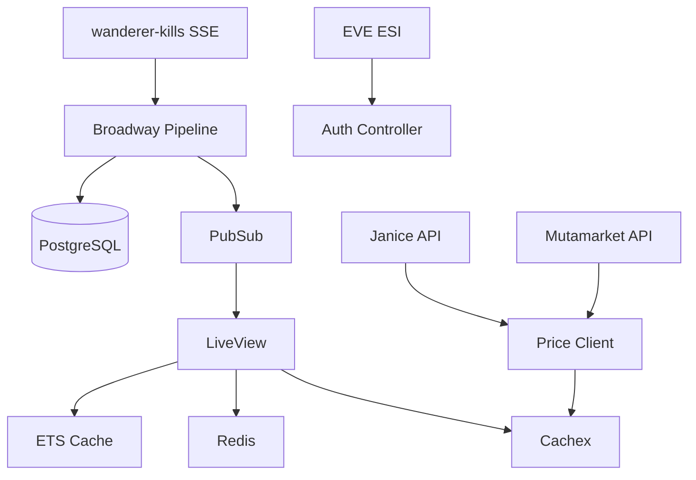

# EVE PvP Tracker - Technical Design Document

## Table of Contents

1. [Architecture Overview](#1-architecture-overview)
2. [Data Model & Partitioning](#2-data-model--partitioning)
3. [Data Ingestion Pipeline](#3-data-ingestion-pipeline)
4. [External Service Integration](#4-external-service-integration)
5. [Caching Strategy](#5-caching-strategy)
6. [Authentication & Authorization](#6-authentication--authorization)
7. [Surveillance & Profile Matching](#7-surveillance--profile-matching)
8. [Performance Optimization](#8-performance-optimization)
9. [Data Freshness Management](#9-data-freshness-management)
10. [Development Environment](#10-development-environment)
11. [Testing & Quality Assurance](#11-testing--quality-assurance)
12. [Deployment & CI/CD](#12-deployment--cicd)

## 1. Architecture Overview

### Technology Stack
- **Backend:** Elixir + Phoenix Framework
- **Database:** PostgreSQL 15+ with range partitioning
- **Cache:** ETS + Redis + Cachex
- **Real-time:** Phoenix LiveView + PubSub
- **Data Pipeline:** Broadway
- **Containerization:** Docker + Kubernetes

### High-Level Architecture



## 2. Data Model & Partitioning

### Core Entity Relationships

See [erDiagram.md](./erDiagram.md) for complete ER diagram.

**Key entities:**
- `users` ↔ `users_characters` ↔ `characters`
- `characters` → `corporations` → `alliances`
- `killmails_raw` ← 1:1 → `killmails_enriched`
- `killmail_participants` (many-to-many)
- `surveillance_profiles` ← 1:many → `surveillance_filters`

### Partitioning Strategy

**Monthly Range Partitioning** on `timestamp` columns:

```sql
-- Parent tables
CREATE TABLE killmails_raw (...) PARTITION BY RANGE (timestamp);
CREATE TABLE killmails_enriched (...) PARTITION BY RANGE (enriched_at);

-- Monthly partitions
CREATE TABLE killmails_raw_2025_06 PARTITION OF killmails_raw
  FOR VALUES FROM ('2025-06-01') TO ('2025-07-01');
```

**Benefits:**
- Query performance: recent data hits 1-2 partitions only
- Index size: bounded per partition
- Maintenance: drop old partitions vs. row-by-row deletes
- Automated partition creation via scheduled jobs

See [PartitioningStrategy.md](./PartitioningStrategy.md) for complete implementation.

## 3. Data Ingestion Pipeline

### Broadway Pipeline Architecture

Single-stage pipeline consuming wanderer-kills SSE feed:

```elixir
# Producer: SSE Consumer (concurrency: 1)
# Processor: Parse & normalize (concurrency: 10)  
# Batchers: 
#   - :db_insert (batch_size: 100, timeout: 200ms)
#   - :pubsub (batch_size: 1)
```

**Data Flow:**
1. **SSE Event** → JSON decode → Broadway Message
2. **Parse Stage** → normalize to `{raw, enriched, participants}` tuple
3. **DB Batcher** → bulk insert all three tables in transaction
4. **PubSub Batcher** → broadcast to LiveView subscribers

**Failover Strategy:**
- Primary: wanderer-kills SSE
- Fallback: zKillboard SSE + local enrichment
- Dead letter queue for failed enrichments

See [KillmailPipeline.md](./KillmailPipeline.md) for complete implementation.

## 4. External Service Integration

### wanderer-kills SSE Feed

**Primary Data Source:**
- Endpoint: `https://wanderer-kills.example.com/sse`
- Provides fully enriched killmails with ISK values, module tags, efficiency metrics
- Rate limiting: respect `Retry-After` headers, exponential backoff

### EVE ESI Integration

**Usage Patterns:**

| Purpose | Endpoint | Frequency | Caching |
|---|---|---|---|
| Character Info | `/latest/characters/{id}/` | On login + refresh | 10 min TTL |
| Corp History | `/latest/characters/{id}/corporationhistory/` | Once per session | 1 hour TTL |
| Universe Types | `/latest/universe/types/` | Nightly import | Persistent |
| System Info | `/latest/universe/systems/{id}/` | On demand | 24 hour TTL |
| Token Refresh | `/latest/oauth/token` | Auto (5 min before expiry) | N/A |

**Rate Limiting:**
- Per-token tracking in ETS
- Token pooling for static data
- Dynamic backoff on 420/429 responses

### Price Data Integration

**Unified Price Service:**
1. **Janice** (primary): 1-hour cache TTL
2. **Mutamarket** (abyssal): 6-hour cache TTL  
3. **Static SDE** (fallback): persistent

See [ServiceIntegration.md](./ServiceIntegration.md) and [OtherData.md](./OtherData.md) for detailed implementation.

## 5. Caching Strategy

### ETS Tables

| Table | Type | Purpose | TTL | Eviction |
|---|---|---|---|---|
| `:char_corp_cache` | `:set` | Character→Corp lookups | 10 min | Time-based |
| `:enrichment_cache` | `:set` | Enriched killmail cache | 24 hrs | Time-based |
| `:price_cache` | `:bag` | Market price cache | 1-6 hrs | Time-based |
| `:static_meta` | `:set` | Item type metadata | ∞ | Manual reload |
| `:by_module_tag` | `:bag` | Profile index by tags | ∞ | Profile change |
| `:by_system_id` | `:bag` | Profile index by system | ∞ | Profile change |
| `:compiled_profiles` | `:set` | Compiled filter functions | ∞ | Profile change |

### Storage Decision Matrix

| Use Case | Storage | Rationale |
|---|---|---|
| Hot character/corp lookups | ETS | <100µs lookups, ephemeral |
| Price data with TTL | Cachex | Built-in TTL management |
| Cross-node presence | Redis | Phoenix.Presence |
| Durable user data | PostgreSQL | ACID compliance |

### Cache Invalidation

- **Time-based:** GenServer cleanup every minute
- **Event-driven:** Profile changes trigger index rebuilds
- **Deployment:** Flush all ETS on startup

See [Caching.md](./Caching.md) for complete strategy.

## 6. Authentication & Authorization

### EVE SSO Integration

**OAuth2 Flow:**
1. Redirect to CCP authorize endpoint
2. Exchange code for access/refresh tokens
3. Store in encrypted session with auto-refresh
4. Handle 401/403 with token refresh + retry

### Access Control Matrix

| Resource | Guest | Authenticated | Corp Officer |
|---|---|---|---|
| Live Kill Feed | ✔️ | ✔️ | ✔️ |
| Character Pages (self) | ❌ | ✔️ | ✔️ |
| Character Pages (other) | ❌ | Conditional* | ✔️ |
| Corp Pages | ❌ | ❌ | ✔️ |
| Fleet Optimizer | ❌ | Conditional* | ✔️ |

*Conditional access based on activity thresholds (≥20 kills/90 days)

### Edge Cases

- **Corp transfers:** 10-minute corp cache TTL + mid-session updates
- **Token expiration:** Automatic refresh + graceful fallback
- **Multiple characters:** Character switcher in UI
- **Role changes:** 30-minute role cache + notification banners

See [AuthEdgeCases.md](./AuthEdgeCases.md) for detailed handling.

## 7. Surveillance & Profile Matching

### Filter JSON Schema

Recursive logical tree structure:

```json
{
  "condition": "and",
  "rules": [
    {
      "field": "module_tags",
      "operator": "contains_any", 
      "value": ["T2"]
    },
    {
      "condition": "or",
      "rules": [
        {"field": "isk_value", "operator": "gt", "value": 100000000},
        {"field": "system_id", "operator": "in", "value": [30000142]}
      ]
    }
  ]
}
```

### Performance Optimization

**Inverted Indexes:**
- Module tags → profile IDs
- System IDs → profile IDs  
- ISK thresholds → sorted profile list

**Matching Algorithm:**
1. Gather candidates from indexes (~150 profiles vs 1000+ total)
2. Apply compiled filter functions
3. Sub-200ms evaluation at 1000 kills/sec

**Pre-compilation:**
- Filter trees → fast BEAM anonymous functions
- Cached in ETS, rebuilt on profile changes

See [ProfileMatching.md](./ProfileMatching.md) for complete implementation.

## 8. Performance Optimization

### LiveView Memory Management

**Temporary Assigns:**
```elixir
socket
|> assign(:kills, [])
|> temporary_assign(:kills, [])  # Auto-pruned after render
```

**Fixed Windows:**
- Live feed: 100 most recent kills
- Pagination for historical data via separate HTTP endpoint

### Message Throttling

**Client-side:**
- Batch updates every 100ms
- `phx-debounce` on inputs

**Server-side:**
- PubSub throttling based on heartbeat latency
- Fixed batch sizes in Broadway pipeline

### Database Performance

**Partitioned Queries:**
- Recent data queries hit 1-2 partitions only
- Composite indexes: `(system_id, timestamp DESC)`
- GIN indexes: `module_tags`, JSONB fields
- Trigram indexes: name search

See [PerfNotes.md](./PerfNotes.md) for detailed optimizations.

## 9. Data Freshness Management

### Enrichment Data Lifecycle

**TTL Management:**
- Cache: 24-hour TTL in ETS
- Stale data: serve immediately + re-queue for refresh
- Failed enrichment: retry queue + UI warning

### Character/Corp Data

**Short-lived Cache:**
- 10-minute TTL for corp/alliance lookups
- Per-request refresh via Phoenix Plug
- Mid-session updates with LiveView notifications

### Permanent Failures

**Retry Strategy:**
- Broadway: 3 attempts with exponential backoff
- Dead letter queue: retry every 10 minutes
- UI: show warning icon for failed enrichments
- Monitoring: alert on >1% failure rate

See [DataFreshness.md](./DataFreshness.md) for complete strategy.

## 10. Development Environment

### Dev Container Setup

**Stack:**
- Elixir 1.15 on Alpine Linux
- Node.js 20.x for asset compilation
- PostgreSQL 15-alpine + Redis 7-alpine
- VS Code extensions: Phoenix, ElixirLS, Prettier

**Configuration:**
- Port forwarding: 4000 (Phoenix), 5432 (Postgres), 6379 (Redis)
- Auto-install dependencies on container creation
- Pre-compiled assets for faster rebuilds

See [devcontainer.md](./devcontainer.md) for complete setup.

## 11. Testing & Quality Assurance

### Test Coverage Requirements

**Unit Tests:**
- [ ] Module tag extraction logic
- [ ] ISK/mass balance/usefulness calculations  
- [ ] Price lookup fallback chains
- [ ] Filter tree compilation & matching

**Integration Tests:**
- [ ] Broadway pipeline message flow
- [ ] ESI client mocking (auth, rate limits)
- [ ] LiveView component interactions
- [ ] Real-time notification delivery

**Edge Case Testing:**
- [ ] Token expiration during active sessions
- [ ] Corporation transfers mid-session
- [ ] Stale enrichment data handling
- [ ] SSE feed interruptions

### Quality Gates

**CI Pipeline:**
1. `mix format --check` (code formatting)
2. `mix credo` (static analysis)
3. `mix dialyzer` (type checking)
4. `mix test --cover` (test coverage)
5. Docker image build & push

See [PRChecklist.md](./PRChecklist.md) for complete checklist.

## 12. Deployment & CI/CD

### Container Strategy

**Development:**
- Docker Compose with hot reload
- Seed data for testing
- Development-optimized builds

**Production:**
- Multi-stage Dockerfile
- Precompiled assets (`MIX_ENV=prod`)
- Minimal runtime image

### Kubernetes Deployment

**Core Services:**
- Phoenix app pods (horizontal scaling)
- PostgreSQL StatefulSet
- Redis cluster for presence

**Background Jobs:**
- Partition creation CronJob
- Cache cleanup DaemonSet
- Static data import Job

### Environments

- **Development:** Local dev containers
- **Staging:** Production-scale testing
- **Production:** Auto-scaled, rolling deployments

---

## Module Tags & Enrichment

### Tag Categories

| Category | Examples | Purpose |
|---|---|---|
| **Tech Level** | T1, T2, T3 | Filter by module quality |
| **Slot Type** | High Slot, Mid Slot, Low Slot, Rig | Filter by fitting location |
| **Weapon Type** | Hybrid, Projectile, Energy, Drone | Filter by weapon systems |
| **Support Modules** | Shield Extender, Armor Repairer | Filter by defensive systems |

### ISK Calculation

**Total Loss Value:**
```elixir
total_isk = hull_price + Enum.sum(for m <- modules, do: m.qty * module_price(m))
```

**Price Sources:**
1. Janice (real market data)
2. Mutamarket (abyssal modules)  
3. Static SDE fallback

### Performance Metrics

**Mass Balance:**
```
balance = destroyed_mass_share - lost_mass
```

**Usefulness Index:**
```
usefulness = actual_participation / expected_participation
```

See [ModuleTags.md](./ModuleTags.md) for complete definitions.

---

This design document provides the complete technical specification for implementing the EVE PvP Tracker. Each section references detailed implementation files for deeper technical details. 